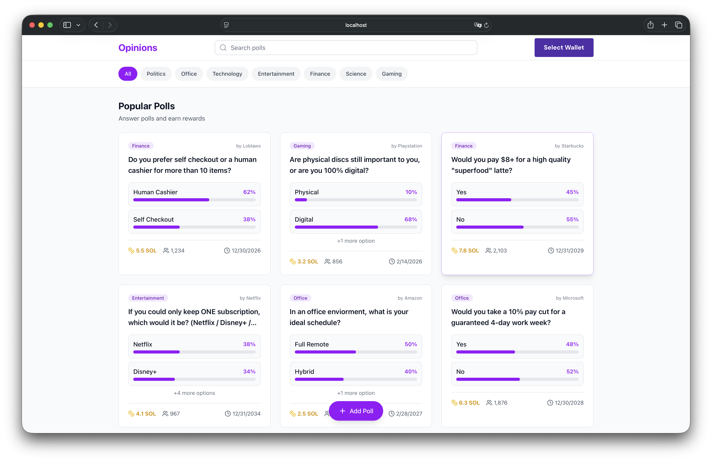

# Opinions - Where Perspectives Pay

**Opinions** is a decentralized application (dApp) built on Solana that allows users to create polls, express their views, and earn rewards for participating in community governance/consensus.



## 🌟 Features

*   **Wallet Integration**: Connect seamlessly with Solana wallets (Phantom, Solflare, etc.).
*   **Create Polls**: Users can launch their own polls with categories, descriptions, and reward pools.
*   **Vote & Earn**: Participate in polls to share the reward pool.
    *   **One Person, One Vote**: Enforces single-vote policy per wallet per poll.
    *   **Real-time Updates**: Vote percentages and counts update instantly.
    *   **Visual Feedback**: Your selected option is highlighted for easy tracking.
*   **Persistence**: Uses local storage to maintain poll state and voting history (Prototype phase).
*   **Admin Tools**: Built-in developer tools to manage/delete unwanted polls.

## 🚀 Getting Started

### Prerequisites

*   Node.js (v16+)
*   npm or yarn
*   A Solana Wallet (e.g., Phantom) installed in your browser.

### Installation

```bash
git clone https://github.com/jojojojo233-bit/Opinions.git

cd Opinions/

npm i

npm run dev
```

4.  Open [http://localhost:3000](http://localhost:3000) (or the port shown in terminal) to view the app.

## 📂 Project Structure

```
src/
├── components/         # React components
│   ├── ui/             # Reusable UI components (Shadcn)
│   ├── PollGrid.tsx    # Main poll display grid
│   ├── PollDetailModal # Modal for voting and details
│   └── ...
├── data/               # Mock data and initial state
├── hooks/              # Custom React hooks (useOpinions)
├── lib/                # Service layers and utilities
└── App.tsx             # Main application logic
```